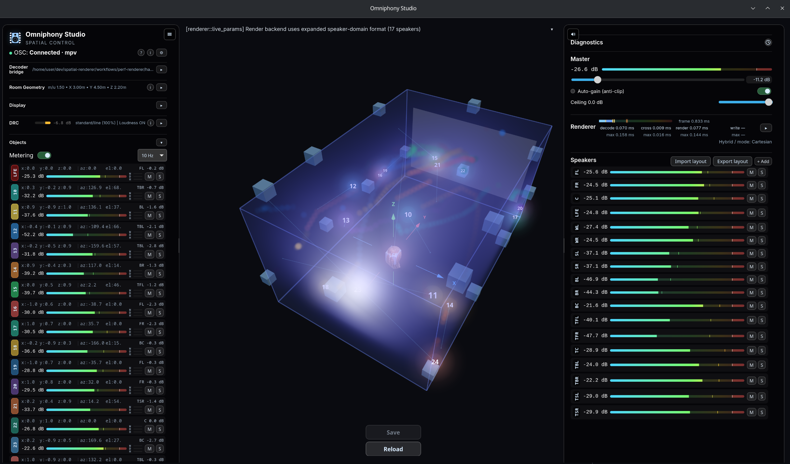

# Omniphony

**A real-time spatial / object-based audio rendering engine.** Omniphony takes
multichannel and object audio and renders it — with VBAP — to any speaker layout
or to **binaural headphones**, in real time. Open source, GPL-3.0.



- 🎧 **Hear it on headphones** — binaural output (HRTF + ITD + live head-tracking),
  no surround rig required.
- 🔊 **Render to any layout** — stereo, 5.1, 7.1, 7.1.4 and beyond, via VBAP.
- 🧩 **Pluggable decoders** — a small, stable ABI (`bridge_api`) loads decoder
  bridges at runtime; bring your own format.
- 🛰️ **Live control + 3D visualization** — Omniphony Studio supervises the engine
  over OSC.

## Hear it in 2 minutes — no media player needed

The engine ships a self-contained demo: a reference WAV decoder bridge plus a
short multichannel clip. From a fresh clone:

```sh
cd omniphony-renderer
./scripts/demo.sh            # builds the engine, then plays the demo on your headphones
```

`scripts/demo.sh` binaurally renders `assets/demo/spatial-demo.wav` — a source
sweeping around you with an overhead tone — straight to your headphones. No
external player, no proprietary decoder. Other modes:

```sh
./scripts/demo.sh speakers   # 7.1.4 speaker render instead of binaural
./scripts/demo.sh file       # no audio device? pipe raw float to ffplay
```

## Frontends

Omniphony is the engine; you can drive it three ways:

| Frontend | What it is |
| --- | --- |
| **`orender` CLI** | The standalone engine binary — render a stream or file to speakers, headphones, or a file/pipe. The demo above uses it. |
| **Omniphony Studio** | Desktop app: 3D visualization, live control, metering, layout management. Prebuilt bundles on the [releases page](https://github.com/mgth/Omniphony/releases/latest) (Linux / Windows / macOS). |
| **[mpv-omniphony](docs/mpv-omniphony.md)** | The [mpv](https://mpv.io/) media player with an opt-in spatial decoder (`--ad=orender`) that renders through the engine instead of downmixing. ([usage guide](docs/mpv-omniphony.md) · [source](https://github.com/mgth/mpv-omniphony)) |

[](docs/mpv-omniphony.md)

## How it works

`omniphony-renderer` loads a **format bridge** at runtime (a `.so` / `.dll`
implementing the `bridge_api` ABI), decodes the input to PCM + object metadata,
and renders it:

- VBAP object → speaker-feed rendering, with loadable speaker layouts and
  precomputed VBAP tables
- real-time output backends — `pipewire` (Linux), `asio` (Windows), CoreAudio
  (macOS), plus a non-realtime **file / stdout / FIFO** backend
- binaural headphone output — HRTF, ITD, early reflections, live head-tracking
- metadata and metering over OSC

The reference bridge in `omniphony-renderer/reference_bridge/` (used by the demo)
is the smallest example of how to add your own decoder. See
[`omniphony-renderer/BRIDGE_API.md`](omniphony-renderer/BRIDGE_API.md).

## Components

### `omniphony-renderer` — the engine

The core engine (executable: `orender`) and its supporting crates:

- `renderer` — VBAP engine, layouts, binaural, OSC output, runtime config
- `audio_output` — PipeWire / ASIO / CoreAudio / file backends
- `audio_input` — live PCM / bridge input
- `bridge_api` — the stable ABI for external decoder bridges
- `reference_bridge` — a reference WAV/PCM decoder bridge (powers the demo)
- `spdif` — IEC 61937 / S/PDIF parsing
- `sys` — platform integration (incl. Windows service)

Start with [`omniphony-renderer/QUICKSTART.md`](omniphony-renderer/QUICKSTART.md).

### `omniphony-studio` — supervision & control

A desktop app that does **not** render audio itself; it connects to the engine
over OSC to visualize objects in a 3D scene, monitor runtime state, and control
selected live parameters. It accepts several OSC input conventions (cartesian,
identifier-in-address, spherical `azimuth/elevation/distance`, explicit removal).

## Repository layout

- `omniphony-renderer/` — engine, CLI, crates, reference bridge
- `omniphony-studio/` — supervision / visualization app
- `docs/` — frontend usage guides (e.g. [mpv-omniphony](docs/mpv-omniphony.md))
- `assets/` — demo clip, logo, captures
- `scripts/` — helpers

## License

GPL-3.0-or-later — see [`LICENSE`](LICENSE). Decoder bridges are loaded at runtime
via `dlopen` and may be licensed separately.

## Support

If Omniphony is useful to you, you can support development with a donation — it
helps maintain and improve the suite.

[](https://www.paypal.com/cgi-bin/webscr?cmd=_donations&business=YLGYPSHWTQ5UW&lc=FR&item_name=Omniphony%C2%A4cy_code=EUR&bn=PP%2dDonationsBF%3abtn_donateCC_LG%2egif%3aNonHosted)
